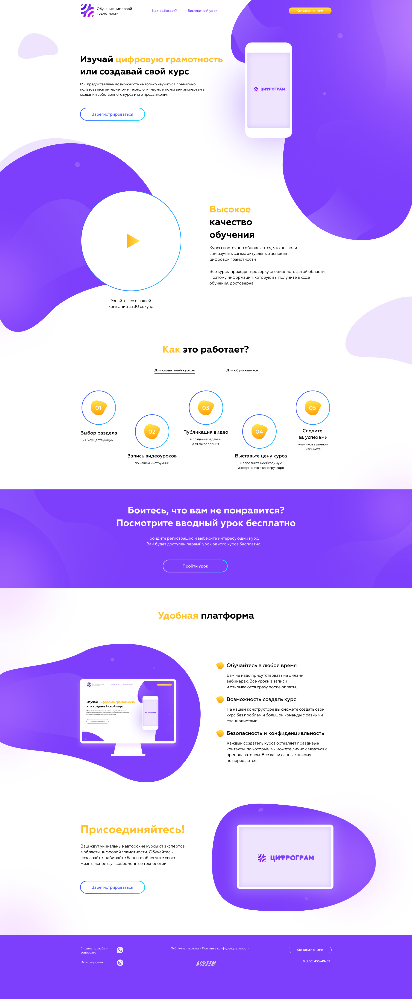

<!--
*** Thanks for checking out the Best-README-Template. If you have a suggestion
*** that would make this better, please fork the repo and create a pull request
*** or simply open an issue with the tag "enhancement".
*** Thanks again! Now go create something AMAZING! :D
-->

<!-- PROJECT SHIELDS -->
<!--
*** I'm using markdown "reference style" links for readability.
*** Reference links are enclosed in brackets [ ] instead of parentheses ( ).
*** See the bottom of this document for the declaration of the reference variables
*** for contributors-url, forks-url, etc. This is an optional, concise syntax you may use.
*** https://www.markdownguide.org/basic-syntax/#reference-style-links
-->
[![Contributors][contributors-shield]][contributors-url]
[![Forks][forks-shield]][forks-url]
[![Stargazers][stars-shield]][stars-url]
[![Issues][issues-shield]][issues-url]
[![MIT License][license-shield]][license-url]
[![LinkedIn][linkedin-shield]][linkedin-url]

<!-- PROJECT LOGO -->
 

  

  <h3 align="center">Цифраграм</h3>

  

    Изучай цифровую грамотность или создавай свой курс
     
    <a href="https://github.com/kdnsks/cifra"><strong>Посмотреть файлы</strong></a>
     
     
    <a href="http://barrstenbeats.myjino.ru/">Посмотреть демо</a>
  

<!-- TABLE OF CONTENTS -->

  
Table of Contents

  <ol>
    <li>
      <a href="#about-the-project">О проекте</a>
      <ul>
        <li><a href="#built-with">Сделан на:</a></li>
      </ul>
    </li>
    <li>
      <a href="#getting-started">Иллюстрации</a>
    </li>
    <li><a href="#contact">Контакты | Contacts</a></li>
  </ol>

<!-- ABOUT THE PROJECT -->
## О проекте

Мы предоставляем возможность не только научиться правильно пользоваться интернетом и технологиями, но и помогаем экспертам в создании собственного курса и его продвижения

### Написан на:

Здесь представлены инструменты, которые использовались для создания проекта и самого кода.
* [Bootstrap](https://getbootstrap.com)
* [JQuery](https://jquery.com)
* [HTML](https://html.com)
* [PHP](https://getbootstrap.com)
* [MySQL](https://jquery.com)
* [JavaScript](https://html.com)

### Иллюстрации

  
  <a href="https://github.com/kdnsks/cifra">
    <video src="Запись экрана (18.04.2021 13-22-12) (convert-video-online.com).mp4" alt="Видео" width="800" height="500">
  </a>
<!-- CONTACT -->
## Контакты

Для связи с нами

  

<!-- MARKDOWN LINKS & IMAGES -->
<!-- https://www.markdownguide.org/basic-syntax/#reference-style-links -->
[contributors-shield]: https://img.shields.io/github/contributors/othneildrew/Best-README-Template.svg?style=for-the-badge
[contributors-url]: https://github.com/othneildrew/Best-README-Template/graphs/contributors
[forks-shield]: https://img.shields.io/github/forks/othneildrew/Best-README-Template.svg?style=for-the-badge
[forks-url]: https://github.com/othneildrew/Best-README-Template/network/members
[stars-shield]: https://img.shields.io/github/stars/othneildrew/Best-README-Template.svg?style=for-the-badge
[stars-url]: https://github.com/othneildrew/Best-README-Template/stargazers
[issues-shield]: https://img.shields.io/github/issues/othneildrew/Best-README-Template.svg?style=for-the-badge
[issues-url]: https://github.com/othneildrew/Best-README-Template/issues
[license-shield]: https://img.shields.io/github/license/othneildrew/Best-README-Template.svg?style=for-the-badge
[license-url]: https://github.com/othneildrew/Best-README-Template/blob/master/LICENSE.txt
[linkedin-shield]: https://img.shields.io/badge/-LinkedIn-black.svg?style=for-the-badge&logo=linkedin&colorB=555
[linkedin-url]: https://linkedin.com/in/othneildrew
[product-screenshot]: images/screenshot.png
